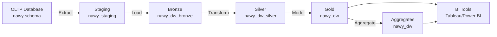

# Nawy Proptech Platform — Data Warehouse Design

> **A Kimball dimensional model optimized for analytical queries across all Nawy business lines**


## 📖 Table of Contents

- [Overview](#-overview)
- [Design Philosophy](#-design-philosophy)
- [Architecture Layers](#-architecture-layers)
- [Dimensional Model](#-dimensional-model)
- [Fact Tables](#-fact-tables)
- [Dimension Tables](#-dimension-tables)
- [Bridge & Helper Tables](#-bridge--helper-tables)
- [Slowly Changing Dimensions](#-slowly-changing-dimensions)
- [Data Lineage & ETL Flow](#-data-lineage--etl-flow)
- [Business Process Coverage](#-business-process-coverage)
- [Physical Design](#-physical-design)
- [Naming Conventions](#-naming-conventions)
- [Query Patterns](#-query-patterns)
- [Performance Strategy](#-performance-strategy)


## 🎯 Overview

### What This Data Warehouse Solves

The **Nawy Operations Database (OLTP)** is optimized for transactional integrity — 20 normalized tables with strict foreign keys. But it's **not optimized for analytics**:

| Challenge | OLTP Impact | DW Solution |
|-----------|-------------|-------------|
| **Complex joins** | 4–6 table joins per query | Pre-joined dimensional model |
| **Historical tracking** | Only current state | Slowly Changing Dimensions (SCD Type 2) |
| **Cross-business analysis** | Separate normalized schemas | Conformed dimensions |
| **Aggregate queries** | Full table scans | Pre-aggregated fact tables |
| **BI tool friction** | Views still require SQL | Star schemas are drag-and-drop |
| **Performance at scale** | Degrades at 1M+ rows | Columnstore indexes, partitioning |

### Design Methodologies Applied

The warehouse follows a **hybrid Kimball + Medallion** architecture:

| Methodology | Purpose | Applied To |
|-------------|---------|-----------|
| **Kimball Dimensional** | Star schemas for BI consumption | Gold layer |
| **Medallion Architecture** | Layered data refinement | Bronze → Silver → Gold |
| **Data Vault 2.0** | Audit and lineage tracking | Silver layer |
| **Inmon CIF** | Enterprise integration | Conformed dimensions |
| **SCD Type 2** | Historical accuracy | Slowly changing dimensions |

### Business Domains Modeled

The DW covers **9 business domains** across Nawy's five business lines:

| # | Domain | Fact Tables | Business Line |
|---|--------|-------------|---------------|
| 1 | **Property** | `FactPropertyListing` | Nawy Properties |
| 2 | **Sales Pipeline** | `FactLead`, `FactDeal` | Nawy Partners |
| 3 | **Mortgage** | `FactMortgageApplication`, `FactMortgagePayment` | Nawy Now |
| 4 | **Fractional Investment** | `FactShareInvestment`, `FactShareExit` | Nawy Shares |
| 5 | **Property Management** | `FactManagementContract`, `FactLease`, `FactRentPayment` | Nawy Unlocked |
| 6 | **Commission** | `FactCommission` | Nawy Partners |
| 7 | **Escrow** | `FactEscrow` | Compliance |
| 8 | **Customer Engagement** | `FactUserActivity` | Cross-cutting |
| 9 | **Financial** | `FactRevenue` | Cross-cutting |

---

## 🏗️ Design Philosophy

### Seven Core Principles

| # | Principle | Implementation |
|---|-----------|----------------|
| 1 | **Business-first modeling** | Start with questions, not tables |
| 2 | **Conformed dimensions** | `DimUser`, `DimProperty`, `DimDate`, `DimGeography` shared across all facts |
| 3 | **Grain clarity** | Every fact table has a single, documented grain |
| 4 | **Additive metrics preferred** | Revenue, count, duration are additive |
| 5 | **Star, not snowflake** | Denormalized dimensions for query speed |
| 6 | **Historical tracking** | SCD Type 2 for user, property, broker |
| 7 | **Slow change survives** | Late-arriving dimension handling, unknown members (-1, 0) |

### The Four Questions Every Fact Table Answers

For each fact table, we explicitly document:

1. **What is the business process?** (e.g., "mortgage payment received")
2. **What is the grain?** (e.g., "one row per payment")
3. **What are the dimensions?** (e.g., "by date, user, property, mortgage")
4. **What are the facts?** (e.g., "amount paid, days late, status flag")

### The DW Bus Matrix

The **Bus Matrix** defines which dimensions apply to which facts:

| Fact Table | DimDate | DimUser | DimProperty | DimBroker | DimDeveloper | DimGeography | DimProduct |
|------------|:-------:|:-------:|:-----------:|:---------:|:------------:|:------------:|:----------:|
| FactPropertyListing | ✅ | ✅ | ✅ | ✅ | ✅ | ✅ | ✅ |
| FactLead | ✅ | ✅ | ✅ | ✅ | ❌ | ✅ | ✅ |
| FactDeal | ✅ | ✅ | ✅ | ✅ | ✅ | ✅ | ✅ |
| FactCommission | ✅ | ✅ | ✅ | ✅ | ❌ | ✅ | ❌ |
| FactMortgageApplication | ✅ | ✅ | ✅ | ❌ | ❌ | ✅ | ✅ |
| FactMortgagePayment | ✅ | ✅ | ✅ | ❌ | ❌ | ✅ | ❌ |
| FactShareOffering | ✅ | ❌ | ✅ | ❌ | ✅ | ✅ | ✅ |
| FactShareInvestment | ✅ | ✅ | ✅ | ❌ | ✅ | ✅ | ✅ |
| FactShareExit | ✅ | ✅ | ✅ | ❌ | ✅ | ✅ | ❌ |
| FactManagementContract | ✅ | ✅ | ✅ | ❌ | ❌ | ✅ | ✅ |
| FactLease | ✅ | ✅ | ✅ | ❌ | ❌ | ✅ | ❌ |
| FactRentPayment | ✅ | ✅ | ✅ | ❌ | ❌ | ✅ | ❌ |
| FactEscrow | ✅ | ✅ | ✅ | ❌ | ❌ | ✅ | ❌ |
| FactUserActivity | ✅ | ✅ | ❌ | ❌ | ❌ | ❌ | ✅ |
| FactRevenue | ✅ | ✅ | ✅ | ✅ | ✅ | ✅ | ✅ |

**Legend**: ✅ = Dimension applies | ❌ = Not applicable

---

## 🏛️ Architecture Layers

The warehouse follows a **three-layer Medallion architecture**:

### Bronze Layer — Raw Ingestion

```
┌─────────────────────────────────────────────────────────┐
│  BRONZE (Raw)                                           │
│  Schema: nawy_dw_bronze                                 │
│  Pattern: Full mirror of OLTP + append-only             │
│  Retention: 90 days                                     │
├─────────────────────────────────────────────────────────┤
│  • bronze_USER                                          │
│  • bronze_PROPERTY                                      │
│  • bronze_LEAD                                          │
│  • bronze_DEAL                                          │
│  • ... (one per source table)                           │
└─────────────────────────────────────────────────────────┘
```

**Purpose**: Immutable copy of source data at ingestion time. Enables replay and audit.

**Key characteristics**:
- One-to-one with OLTP tables
- No transformations — raw as-is
- Append-only with `_ingested_at` timestamp
- Never deleted

### Silver Layer — Cleansed & Integrated

```
┌─────────────────────────────────────────────────────────┐
│  SILVER (Cleansed)                                      │
│  Schema: nawy_dw_silver                                 │
│  Pattern: Deduplicated, standardized, historized        │
│  Retention: 3 years                                     │
├─────────────────────────────────────────────────────────┤
│  • silver_USER_clean                                    │
│  • silver_PROPERTY_clean                                │
│  • silver_LEAD_clean                                    │
│  • silver_DEAL_clean                                    │
│  • ... (cleansed, deduplicated)                         │
│  • data_quality_issues                                  │
│  • audit_log                                            │
└─────────────────────────────────────────────────────────┘
```

**Purpose**: Cleansed, standardized, and integrated data. Handles duplicates, standardizes codes, resolves conflicts.

**Transformations applied**:
- Type casting and standardization
- Deduplication (keep most recent)
- NULL handling (defaults, imputation)
- Referential integrity enforcement
- Data quality flagging
- SCD Type 2 historization

### Gold Layer — Business-Ready

```
┌─────────────────────────────────────────────────────────┐
│  GOLD (Dimensional)                                     │
│  Schema: nawy_dw                                       │
│  Pattern: Star schemas, Kimball dimensional             │
│  Retention: 7 years                                     │
├─────────────────────────────────────────────────────────┤
│  DIMENSIONS:                                            │
│  • DimDate                                              │
│  • DimUser                                              │
│  • DimProperty                                          │
│  • DimBroker                                            │
│  • DimDeveloper                                         │
│  • DimGeography                                         │
│  • DimProduct                                           │
│  • DimStatus                                            │
│                                                         │
│  FACTS:                                                 │
│  • FactPropertyListing                                  │
│  • FactLead                                             │
│  • FactDeal                                             │
│  • FactCommission                                       │
│  • FactMortgageApplication                              │
│  • FactMortgagePayment                                  │
│  • FactShareOffering                                    │
│  • FactShareInvestment                                  │
│  • FactShareExit                                        │
│  • FactManagementContract                               │
│  • FactLease                                            │
│  • FactRentPayment                                      │
│  • FactEscrow                                           │
│  • FactUserActivity                                     │
│  • FactRevenue                                          │
│                                                         │
│  MART AGGREGATES:                                       │
│  • AggDailySales                                        │
│  • AggDailyRevenue                                      │
│  • AggMonthlyKPIs                                       │
│  • AggBrokerPerformance                                 │
│  • AggPropertyPerformance                               │
└─────────────────────────────────────────────────────────┘
```

**Purpose**: Business-ready star schemas for BI tools. Optimized for query performance.

**Design principles**:
- Star schemas (single-level dimensions)
- Denormalized dimensions
- Additive facts preferred
- Pre-computed aggregates for common questions
- Columnstore indexes for scans

---

## 🧩 Dimensional Model

### Complete Star Schema

```mermaid
erDiagram
    DimDate ||--o{ FactDeal : "closed on"
    DimDate ||--o{ FactLead : "created on"
    DimDate ||--o{ FactMortgagePayment : "due on"
    DimDate ||--o{ FactRentPayment : "due on"
    DimDate ||--o{ FactShareInvestment : "invested on"
    DimDate ||--o{ FactRevenue : "recognized on"
    DimDate ||--o{ FactUserActivity : "activity date"

    DimUser ||--o{ FactLead : "buyer"
    DimUser ||--o{ FactDeal : "buyer"
    DimUser ||--o{ FactMortgageApplication : "applicant"
    DimUser ||--o{ FactShareInvestment : "investor"
    DimUser ||--o{ FactManagementContract : "owner"
    DimUser ||--o{ FactRentPayment : "receives"
    DimUser ||--o{ FactUserActivity : "actor"

    DimProperty ||--o{ FactPropertyListing : "listing"
    DimProperty ||--o{ FactLead : "property of interest"
    DimProperty ||--o{ FactDeal : "sold"
    DimProperty ||--o{ FactMortgageApplication : "financed"
    DimProperty ||--o{ FactShareOffering : "underlying"
    DimProperty ||--o{ FactManagementContract : "managed"
    DimProperty ||--o{ FactLease : "leased"
    DimProperty ||--o{ FactRentPayment : "rented"

    DimBroker ||--o{ FactLead : "handles"
    DimBroker ||--o{ FactDeal : "closes"
    DimBroker ||--o{ FactCommission : "earns"

    DimDeveloper ||--o{ FactPropertyListing : "develops"
    DimDeveloper ||--o{ FactShareOffering : "owns"

    DimGeography ||--o{ FactPropertyListing : "located in"
    DimGeography ||--o{ FactLead : "region of interest"

    DimProduct ||--o{ FactRevenue : "revenue source"
    DimProduct ||--o{ FactUserActivity : "activity type"

    FactDeal ||--o| FactCommission : "generates"
    FactMortgageApplication ||--o{ FactMortgagePayment : "has installments"
    FactShareOffering ||--o{ FactShareInvestment : "receives"
    FactShareInvestment ||--o| FactShareExit : "exits"
    FactManagementContract ||--o{ FactLease : "administers"
    FactLease ||--o{ FactRentPayment : "generates"
```



---

## 📊 Fact Tables

Each fact table is documented with its **business process, grain, dimensions, and measures**.

### FACT 1 — `FactPropertyListing`

**Business Process**: A property is listed on the platform.

| Attribute | Value |
|-----------|-------|
| **Grain** | One row per property listing snapshot per day |
| **Type** | Periodic snapshot |
| **Rows (year)** | ~180,000 (520 properties × 365 days) |
| **Update pattern** | Daily refresh |

**Dimensions**: `DimDate`, `DimProperty`, `DimUser (owner)`, `DimBroker`, `DimDeveloper`, `DimGeography`, `DimProduct`

**Measures**:

| Measure | Type | Description |
|---------|------|-------------|
| `price_egp` | Additive (semi) | Listed price |
| `price_per_sqm_egp` | Non-additive | Computed ratio |
| `days_on_market` | Additive | Days since listing |
| `view_count` | Additive | (from activity log) |
| `lead_count` | Additive | Leads generated |
| `is_active_flag` | Additive | 1 if active, 0 if not |
| `is_sold_flag` | Additive | 1 if sold |

**Example query**:
```sql
SELECT
    d.year, d.month,
    g.city,
    AVG(f.price_per_sqm_egp) AS avg_price_per_sqm
FROM nawy_dw.FactPropertyListing f
JOIN nawy_dw.DimDate d ON f.date_key = d.date_key
JOIN nawy_dw.DimGeography g ON f.geography_key = g.geography_key
GROUP BY d.year, d.month, g.city;
```

---

### FACT 2 — `FactLead`

**Business Process**: A prospective buyer expresses interest in a property.

| Attribute | Value |
|-----------|-------|
| **Grain** | One row per lead |
| **Type** | Transaction |
| **Rows (year)** | ~1,400 |
| **Update pattern** | Real-time append |

**Dimensions**: `DimDate (created, last activity)`, `DimUser (buyer)`, `DimProperty`, `DimBroker`, `DimGeography`, `DimProduct (source)`

**Measures**:

| Measure | Type | Description |
|---------|------|-------------|
| `days_in_pipeline` | Additive | Days from creation to last activity |
| `is_won_flag` | Additive | 1 if closed_won |
| `is_lost_flag` | Additive | 1 if closed_lost |
| `is_open_flag` | Additive | 1 if still open |
| `conversion_days` | Additive | Days to close (NULL if open) |

**Bus matrix row**: source-based segmentation, broker attribution, funnel analysis.

---

### FACT 3 — `FactDeal`

**Business Process**: A property transaction is completed.

| Attribute | Value |
|-----------|-------|
| **Grain** | One row per completed deal |
| **Type** | Transaction |
| **Rows (year)** | ~380 |
| **Update pattern** | Real-time append |

**Dimensions**: `DimDate (closed)`, `DimUser (buyer)`, `DimProperty`, `DimBroker`, `DimDeveloper`, `DimGeography`, `DimProduct (payment type)`

**Measures**:

| Measure | Type | Description |
|---------|------|-------------|
| `sale_price_egp` | Additive | Final sale price |
| `list_price_egp` | Additive | Original list price |
| `discount_egp` | Additive | list_price − sale_price |
| `discount_pct` | Non-additive | Discount percentage |
| `days_to_close` | Additive | Days from lead to close |
| `commission_amount_egp` | Additive | Broker commission |
| `gmv_egp` | Additive | Gross merchandise value |

---

### FACT 4 — `FactCommission`

**Business Process**: A broker earns a commission from a completed deal.

| Attribute | Value |
|-----------|-------|
| **Grain** | One row per commission payment |
| **Type** | Transaction |
| **Rows (year)** | ~375 |
| **Update pattern** | Event-driven |

**Dimensions**: `DimDate (paid)`, `DimUser (broker)`, `DimBroker`, `DimProperty`, `DimProduct (commission type)`

**Measures**:

| Measure | Type | Description |
|---------|------|-------------|
| `commission_amount_egp` | Additive | Amount |
| `commission_rate` | Non-additive | Percentage rate |
| `days_to_payment` | Additive | Days from deal to payment |
| `is_paid_flag` | Additive | 1 if paid |

---

### FACT 5 — `FactMortgageApplication`

**Business Process**: A user applies for a Nawy Now mortgage.

| Attribute | Value |
|-----------|-------|
| **Grain** | One row per mortgage application |
| **Type** | Accumulating snapshot |
| **Rows (year)** | ~280 |
| **Update pattern** | Daily update as status changes |

**Dimensions**: `DimDate (submitted, approved)`, `DimUser (applicant)`, `DimProperty`, `DimGeography`, `DimProduct`

**Measures**:

| Measure | Type | Description |
|---------|------|-------------|
| `property_price_egp` | Additive | Property price |
| `down_payment_egp` | Additive | Down payment |
| `loan_amount_egp` | Additive | Loan principal |
| `monthly_payment_egp` | Additive | Fixed monthly installment |
| `installment_months` | Additive | Term in months |
| `interest_rate` | Non-additive | Annual rate |
| `days_to_approval` | Additive | Submission → approval |
| `is_approved_flag` | Additive | 1 if approved |
| `is_disbursed_flag` | Additive | 1 if disbursed |

---

### FACT 6 — `FactMortgagePayment`

**Business Process**: A mortgage installment is due or paid.

| Attribute | Value |
|-----------|-------|
| **Grain** | One row per installment |
| **Type** | Transaction |
| **Rows (year)** | ~4,200 |
| **Update pattern** | Daily |

**Dimensions**: `DimDate (due, paid)`, `DimUser (borrower)`, `DimProperty`

**Measures**:

| Measure | Type | Description |
|---------|------|-------------|
| `amount_due_egp` | Additive | Expected payment |
| `amount_paid_egp` | Additive | Actual payment |
| `amount_outstanding_egp` | Additive | amount_due − amount_paid |
| `days_late` | Additive | Days past due |
| `is_paid_flag` | Additive | 1 if paid |
| `is_overdue_flag` | Additive | 1 if overdue |

---

### FACT 7 — `FactShareOffering`

**Business Process**: A property is offered for fractional investment.

| Attribute | Value |
|-----------|-------|
| **Grain** | One row per offering (daily snapshot) |
| **Type** | Periodic snapshot |
| **Rows (year)** | ~31,000 (85 offerings × 365 days) |
| **Update pattern** | Daily snapshot |

**Dimensions**: `DimDate`, `DimProperty`, `DimDeveloper`, `DimGeography`, `DimProduct`, `DimStatus`

**Measures**:

| Measure | Type | Description |
|---------|------|-------------|
| `total_value_egp` | Additive | Total offering value |
| `share_price_egp` | Additive | Price per share |
| `total_shares` | Additive | Total shares |
| `shares_sold` | Additive | Sold shares |
| `shares_available` | Additive | Remaining shares |
| `subscribed_egp` | Additive | Total funds raised |
| `sold_pct` | Non-additive | % of shares sold |

---

### FACT 8 — `FactShareInvestment`

**Business Process**: A user invests in a fractional offering.

| Attribute | Value |
|-----------|-------|
| **Grain** | One row per investment transaction |
| **Type** | Transaction |
| **Rows (year)** | ~620 |
| **Update pattern** | Real-time append |

**Dimensions**: `DimDate`, `DimUser (investor)`, `DimProperty`, `DimDeveloper`, `DimGeography`, `DimProduct`

**Measures**:

| Measure | Type | Description |
|---------|------|-------------|
| `shares_purchased` | Additive | Number of shares |
| `total_amount_egp` | Additive | Amount invested |
| `price_per_share_egp` | Non-additive | Purchase price |
| `is_active_flag` | Additive | 1 if active |

---

### FACT 9 — `FactShareExit`

**Business Process**: A fractional investor exits their position.

| Attribute | Value |
|-----------|-------|
| **Grain** | One row per exit event |
| **Type** | Transaction |
| **Rows (year)** | ~185 |
| **Update pattern** | Event-driven |

**Dimensions**: `DimDate (exit date)`, `DimUser (investor)`, `DimProperty`, `DimDeveloper`, `DimGeography`

**Measures**:

| Measure | Type | Description |
|---------|------|-------------|
| `exit_price_per_share_egp` | Non-additive | Sale price |
| `total_sale_value_egp` | Additive | Total proceeds |
| `exit_fee_egp` | Additive | Platform fee |
| `profit_loss_egp` | Additive | Net gain/loss |
| `roi_pct` | Non-additive | Return % |
| `holding_days` | Additive | Days held |

---

### FACT 10 — `FactManagementContract`

**Business Process**: A property owner signs a Nawy Unlocked contract.

| Attribute | Value |
|-----------|-------|
| **Grain** | One row per contract (daily snapshot) |
| **Type** | Periodic snapshot |
| **Rows (year)** | ~77,000 (210 contracts × 365 days) |
| **Update pattern** | Daily snapshot |

**Dimensions**: `DimDate`, `DimUser (owner)`, `DimProperty`, `DimGeography`, `DimProduct (service type)`, `DimStatus`

**Measures**:

| Measure | Type | Description |
|---------|------|-------------|
| `management_fee_pct` | Non-additive | Fee percentage |
| `financing_pct` | Non-additive | Financed portion |
| `contract_days` | Additive | Days active |
| `is_active_flag` | Additive | 1 if active |
| `total_contracts` | Additive | Always 1 (count helper) |

---

### FACT 11 — `FactLease`

**Business Process**: A tenant signs a lease for a managed property.

| Attribute | Value |
|-----------|-------|
| **Grain** | One row per lease |
| **Type** | Accumulating snapshot |
| **Rows (year)** | ~340 |
| **Update pattern** | Daily update as status changes |

**Dimensions**: `DimDate (start, end)`, `DimUser (tenant)`, `DimUser (owner)`, `DimProperty`, `DimGeography`

**Measures**:

| Measure | Type | Description |
|---------|------|-------------|
| `monthly_rent_egp` | Additive | Monthly rent |
| `security_deposit_egp` | Additive | Deposit |
| `lease_days` | Additive | Length in days |
| `is_active_flag` | Additive | 1 if active |
| `is_expired_flag` | Additive | 1 if expired |

---

### FACT 12 — `FactRentPayment`

**Business Process**: A rent installment is due or paid.

| Attribute | Value |
|-----------|-------|
| **Grain** | One row per rent installment |
| **Type** | Transaction |
| **Rows (year)** | ~2,800 |
| **Update pattern** | Daily |

**Dimensions**: `DimDate (due, paid)`, `DimUser (tenant)`, `DimUser (owner)`, `DimProperty`, `DimGeography`

**Measures**:

| Measure | Type | Description |
|---------|------|-------------|
| `amount_egp` | Additive | Rent amount |
| `management_fee_egp` | Additive | Nawy's cut |
| `net_to_owner_egp` | Additive | Owner payout |
| `days_late` | Additive | Days past due |
| `is_paid_flag` | Additive | 1 if paid |
| `is_overdue_flag` | Additive | 1 if overdue |

---

### FACT 13 — `FactEscrow`

**Business Process**: Funds are held in escrow for a transaction.

| Attribute | Value |
|-----------|-------|
| **Grain** | One row per escrow account (daily snapshot) |
| **Type** | Periodic snapshot |
| **Rows (year)** | ~57,000 (155 escrows × 365 days) |
| **Update pattern** | Daily snapshot |

**Dimensions**: `DimDate`, `DimUser`, `DimProperty`, `DimProduct`, `DimStatus`

**Measures**:

| Measure | Type | Description |
|---------|------|-------------|
| `deposit_amount_egp` | Additive | Funds held |
| `holding_days` | Additive | Days in escrow |
| `is_released_flag` | Additive | 1 if released |
| `is_disputed_flag` | Additive | 1 if disputed |
| `is_active_flag` | Additive | 1 if active |

---

### FACT 14 — `FactUserActivity`

**Business Process**: A user performs an action on the platform.

| Attribute | Value |
|-----------|-------|
| **Grain** | One row per activity event |
| **Type** | Transaction |
| **Rows (year)** | ~500,000 (estimated) |
| **Update pattern** | Real-time stream |

**Dimensions**: `DimDate`, `DimUser`, `DimProduct (activity type)`

**Measures**:

| Measure | Type | Description |
|---------|------|-------------|
| `event_count` | Additive | Always 1 |
| `session_duration_sec` | Additive | Time spent |
| `is_conversion_flag` | Additive | 1 if resulted in purchase |

**Activity types**:
- `search`, `view_property`, `save_favorite`, `contact_broker`, `submit_lead`, `view_mortgage`, `invest_shares`, `sign_lease`

---

### FACT 15 — `FactRevenue`

**Business Process**: Revenue is recognized from any business line.

| Attribute | Value |
|-----------|-------|
| **Grain** | One row per revenue recognition event |
| **Type** | Transaction |
| **Rows (year)** | ~2,500 |
| **Update pattern** | Daily |

**Dimensions**: `DimDate`, `DimUser`, `DimProperty`, `DimBroker`, `DimDeveloper`, `DimGeography`, `DimProduct (revenue source)`

**Measures**:

| Measure | Type | Description |
|---------|------|-------------|
| `revenue_amount_egp` | Additive | Revenue amount |
| `cost_amount_egp` | Additive | Cost of service |
| `margin_egp` | Additive | Revenue − Cost |
| `is_recurring_flag` | Additive | 1 if recurring |

**Revenue sources** (product dimension members):
- `broker_commission`, `mortgage_interest`, `shares_exit_fee`, `management_fee`, `finishing_fee`

---

## 📐 Dimension Tables

### DIM 1 — `DimDate` (Conformed, Static)

**Purpose**: Standard date dimension for all time-based analysis.

**Grain**: One row per calendar day.

**Range**: 2020-01-01 to 2030-12-31 (11 years).

| Column | Type | Description |
|--------|------|-------------|
| `date_key` | INT (PK) | YYYYMMDD format (e.g., 20260930) |
| `date` | DATE | Full date |
| `day_of_week` | INT | 1=Sunday, 7=Saturday |
| `day_name` | NVARCHAR | Sunday, Monday, ... |
| `day_of_month` | INT | 1–31 |
| `day_of_year` | INT | 1–366 |
| `week_of_year` | INT | 1–53 |
| `month` | INT | 1–12 |
| `month_name` | NVARCHAR | January, February, ... |
| `quarter` | INT | 1–4 |
| `year` | INT | 2020–2030 |
| `year_month` | NVARCHAR | "2026-09" |
| `year_quarter` | NVARCHAR | "2026-Q3" |
| `is_weekend` | BIT | 1 if Friday/Saturday |
| `is_holiday` | BIT | Egyptian holidays |
| `is_ramadan` | BIT | Islamic calendar flag |
| `is_business_day` | BIT | Working day flag |
| `fiscal_year` | INT | Aligned to fiscal calendar |
| `fiscal_quarter` | INT | |

---

### DIM 2 — `DimUser` (SCD Type 2)

**Purpose**: User dimension with historical tracking.

**Grain**: One row per user per version (SCD Type 2).

| Column | Type | Description |
|--------|------|-------------|
| `user_key` | BIGINT (PK) | Surrogate key (auto-increment) |
| `user_id` | BIGINT | Natural key from OLTP |
| `email` | NVARCHAR | Current email |
| `full_name` | NVARCHAR | Current name |
| `phone` | NVARCHAR | Current phone |
| `user_type` | NVARCHAR | Current primary type |
| `national_id` | NVARCHAR | (masked) |
| `is_verified` | BIT | |
| `registration_date` | DATE | |
| `country` | NVARCHAR | Egypt |
| `city` | NVARCHAR | |
| `acquisition_channel` | NVARCHAR | website, app, referral |
| `lifetime_days` | INT | Days since registration |
| `business_lines_engaged` | INT | Count of business lines |
| `is_vip` | BIT | Derived from CLV |
| `valid_from` | DATETIMEOFFSET | SCD Type 2 |
| `valid_to` | DATETIMEOFFSET | SCD Type 2 |
| `is_current` | BIT | SCD Type 2 flag |

**SCD Type 2 tracking**: Changes to `email`, `phone`, `user_type`, `city` create new versions.

---

### DIM 3 — `DimProperty` (SCD Type 2)

**Purpose**: Property dimension with historical tracking.

**Grain**: One row per property per version.

| Column | Type | Description |
|--------|------|-------------|
| `property_key` | BIGINT (PK) | Surrogate key |
| `property_id` | BIGINT | Natural key |
| `title` | NVARCHAR | |
| `property_type` | NVARCHAR | apartment, villa, chalet, etc. |
| `listing_type` | NVARCHAR | primary, resale, rental |
| `bedrooms` | INT | |
| `bathrooms` | INT | |
| `area_sqm` | DECIMAL | |
| `finishing_status` | NVARCHAR | |
| `furnished_status` | NVARCHAR | |
| `current_price_egp` | DECIMAL | |
| `current_status` | NVARCHAR | active, sold, rented |
| `latitude` | DECIMAL | |
| `longitude` | DECIMAL | |
| `developer_id` | BIGINT | FK |
| `compound_name` | NVARCHAR | |
| `city` | NVARCHAR | |
| `district` | NVARCHAR | |
| `geography_key` | BIGINT | FK to DimGeography |
| `listing_date` | DATE | |
| `days_on_market` | INT | |
| `valid_from` | DATETIMEOFFSET | SCD Type 2 |
| `valid_to` | DATETIMEOFFSET | |
| `is_current` | BIT | |

---

### DIM 4 — `DimBroker` (SCD Type 2)

**Purpose**: Broker dimension.

**Grain**: One row per broker per version.

| Column | Type | Description |
|--------|------|-------------|
| `broker_key` | BIGINT (PK) | |
| `broker_id` | BIGINT | Natural key |
| `broker_name` | NVARCHAR | |
| `email` | NVARCHAR | |
| `broker_type` | NVARCHAR | freelancer, agency |
| `agency_name` | NVARCHAR | |
| `license_number` | NVARCHAR | |
| `commission_rate` | DECIMAL | |
| `team_size` | INT | |
| `status` | NVARCHAR | |
| `joined_date` | DATE | |
| `tenure_days` | INT | |
| `performance_tier` | NVARCHAR | Platinum, Gold, Silver, Bronze |
| `valid_from` | DATETIMEOFFSET | |
| `valid_to` | DATETIMEOFFSET | |
| `is_current` | BIT | |

---

### DIM 5 — `DimDeveloper`

**Purpose**: Real estate developer dimension.

**Grain**: One row per developer.

| Column | Type | Description |
|--------|------|-------------|
| `developer_key` | BIGINT (PK) | |
| `developer_id` | BIGINT | Natural key |
| `name` | NVARCHAR | |
| `partnership_tier` | NVARCHAR | standard, premium, exclusive |
| `contact_email` | NVARCHAR | |
| `contact_phone` | NVARCHAR | |
| `total_projects` | INT | |
| `joined_date` | DATE | |
| `is_active` | BIT | |

---

### DIM 6 — `DimGeography`

**Purpose**: Geographic hierarchy for location analysis.

**Grain**: One row per unique location (city/district/compound combination).

| Column | Type | Description |
|--------|------|-------------|
| `geography_key` | BIGINT (PK) | |
| `city` | NVARCHAR | Cairo, Giza, Alexandria, etc. |
| `district` | NVARCHAR | New Cairo, Sheikh Zayed, etc. |
| `compound` | NVARCHAR | Villette, Marassi, Badya |
| `region` | NVARCHAR | Greater Cairo, North Coast, etc. |
| `latitude` | DECIMAL | |
| `longitude` | DECIMAL | |
| `is_coastal` | BIT | |
| `is_new_development` | BIT | |
| `avg_price_per_sqm` | DECIMAL | Static cache |

---

### DIM 7 — `DimProduct`

**Purpose**: Product and service dimension.

**Grain**: One row per product/service.

| Column | Type | Description |
|--------|------|-------------|
| `product_key` | BIGINT (PK) | |
| `product_code` | NVARCHAR | |
| `product_name` | NVARCHAR | |
| `business_line` | NVARCHAR | Properties, Partners, Now, Shares, Unlocked |
| `service_type` | NVARCHAR | |
| `revenue_model` | NVARCHAR | commission, interest, fee, subscription |
| `is_recurring` | BIT | |

**Product members**:

| Code | Name | Business Line |
|------|------|---------------|
| `PROP_LIST` | Property Listing | Properties |
| `LEAD_CAPTURE` | Lead Capture | Properties |
| `BROKER_COMMISSION` | Broker Commission | Partners |
| `MORTGAGE` | Mortgage Loan | Now |
| `SHARE_OFFERING` | Fractional Offering | Shares |
| `SHARE_INVESTMENT` | Fractional Investment | Shares |
| `MGMT_FULL` | Full Management | Unlocked |
| `MGMT_RENTAL` | Rental Only | Unlocked |
| `FINISHING` | Finishing Service | Unlocked |

---

### DIM 8 — `DimStatus`

**Purpose**: Status dimension for all workflow states.

**Grain**: One row per (entity_type, status_code).

| Column | Type | Description |
|--------|------|-------------|
| `status_key` | BIGINT (PK) | |
| `entity_type` | NVARCHAR | lead, deal, mortgage, lease, etc. |
| `status_code` | NVARCHAR | |
| `status_name` | NVARCHAR | |
| `is_terminal` | BIT | Is it a final state? |
| `is_won` | BIT | Positive outcome? |
| `is_lost` | BIT | Negative outcome? |
| `sort_order` | INT | For funnel ordering |

---

## 🌉 Bridge & Helper Tables

### Bridge 1 — `BridgePropertyDeveloper`

**Purpose**: Property ↔ Developer many-to-many bridge (for properties with joint ventures).

| Column | Type | Description |
|--------|------|-------------|
| `property_key` | BIGINT (FK) | |
| `developer_key` | BIGINT (FK) | |
| `role` | NVARCHAR | primary, secondary |
| `revenue_share_pct` | DECIMAL | |

### Bridge 2 — `BridgeUserBusinessLine`

**Purpose**: User ↔ Business Line engagement bridge (for cross-sell analysis).

| Column | Type | Description |
|--------|------|-------------|
| `user_key` | BIGINT (FK) | |
| `business_line` | NVARCHAR | |
| `first_engagement_date` | DATE | |
| `last_engagement_date` | DATE | |
| `engagement_count` | INT | |
| `lifetime_value_egp` | DECIMAL | |

### Helper 1 — `UnknownMember`

Every dimension has an "unknown" row with key = `-1` to handle late-arriving dimensions.

### Helper 2 — `DateRange`

| Column | Type | Description |
|--------|------|-------------|
| `range_key` | INT | |
| `range_name` | NVARCHAR | Last 7 days, Last 30 days, YTD, etc. |
| `start_date` | DATE | |
| `end_date` | DATE | |

---

## 🔄 Slowly Changing Dimensions

### SCD Strategy by Dimension

| Dimension | SCD Type | Tracked Attributes | Rationale |
|-----------|----------|-------------------|-----------|
| `DimUser` | Type 2 | email, phone, user_type, city | Historical analysis of user evolution |
| `DimProperty` | Type 2 | price, status, finishing | Price and status history critical |
| `DimBroker` | Type 2 | commission_rate, team_size, tier | Broker evolution |
| `DimDeveloper` | Type 1 | contact info | Overwrite — rarely changes |
| `DimGeography` | Type 1 | avg_price_per_sqm | Cache only — overwrite |
| `DimProduct` | Type 0 | (static) | Never changes |
| `DimDate` | Type 0 | (static) | Never changes |
| `DimStatus` | Type 0 | (static) | Never changes |

### SCD Type 2 Implementation

For `DimUser`:

```sql
-- On UPDATE to tracked attributes:
-- 1. Close current version (set valid_to, is_current = 0)
UPDATE nawy_dw.DimUser
SET valid_to = SYSDATETIMEOFFSET(),
    is_current = 0
WHERE user_id = @user_id
  AND is_current = 1;

-- 2. Insert new version
INSERT INTO nawy_dw.DimUser (...)
VALUES (..., @new_values, SYSDATETIMEOFFSET(), NULL, 1);
```

### Late-Arriving Dimensions

When a fact references a `user_id` that doesn't yet exist in `DimUser`:

1. Insert an **"Inferred Member"** row with `user_key = -2` and minimal attributes
2. When the dimension arrives, update the inferred row and any facts pointing to it
3. Track via `inferred_flag` column

---

## 🔀 Data Lineage & ETL Flow

### ETL Pipeline Overview



### Layer Details

| Layer | Purpose | Refresh | Retention |
|-------|---------|---------|-----------|
| **Staging** | Temporary landing | Real-time | 7 days |
| **Bronze** | Raw mirror | Daily | 90 days |
| **Silver** | Cleansed | Daily | 3 years |
| **Gold** | Dimensional | Daily | 7 years |
| **Aggregates** | Pre-computed | Hourly | 7 years |

### ETL Jobs Schedule

| Job | Frequency | Runtime (est.) | Dependencies |
|-----|-----------|---------------|--------------|
| `ETL_Stage_OLTP` | Every 15 min | 30 sec | None |
| `ETL_Bronze_Load` | Hourly | 1 min | Stage complete |
| `ETL_Silver_Cleansing` | Daily at 1 AM | 5 min | Bronze complete |
| `ETL_Gold_Dimensions` | Daily at 2 AM | 3 min | Silver complete |
| `ETL_Gold_Facts` | Daily at 3 AM | 10 min | Dimensions complete |
| `ETL_Aggregates` | Hourly | 2 min | Facts complete |
| `ETL_DataQuality` | Daily at 5 AM | 2 min | All complete |

---

## 📊 Business Process Coverage

The DW covers **15 business processes** across **9 domains**:

| # | Process | Fact Table | Domain | Business Line |
|---|---------|-----------|--------|---------------|
| 1 | Property listing | FactPropertyListing | Property | Properties |
| 2 | Lead generation | FactLead | Sales | Properties |
| 3 | Deal completion | FactDeal | Sales | Partners |
| 4 | Commission payment | FactCommission | Sales | Partners |
| 5 | Mortgage application | FactMortgageApplication | Mortgage | Now |
| 6 | Mortgage payment | FactMortgagePayment | Mortgage | Now |
| 7 | Fractional offering | FactShareOffering | Investment | Shares |
| 8 | Fractional investment | FactShareInvestment | Investment | Shares |
| 9 | Fractional exit | FactShareExit | Investment | Shares |
| 10 | Management contract | FactManagementContract | Management | Unlocked |
| 11 | Lease signing | FactLease | Management | Unlocked |
| 12 | Rent payment | FactRentPayment | Management | Unlocked |
| 13 | Escrow holding | FactEscrow | Compliance | All |
| 14 | User activity | FactUserActivity | Engagement | All |
| 15 | Revenue recognition | FactRevenue | Financial | All |

---

## 🏗️ Physical Design

### Filegroup Layout

| Filegroup | Purpose | Contents |
|-----------|---------|----------|
| `PRIMARY` | Metadata | System tables |
| `FG_DIM` | Dimensions | All Dim tables |
| `FG_FACT_CURRENT` | Current year facts | Facts for current year |
| `FG_FACT_HISTORY` | Historical facts | Facts for prior years |
| `FG_AGG` | Aggregates | All Agg tables |
| `FG_INDEX` | Indexes | Non-clustered indexes |

### Partitioning Strategy

**Fact tables** are partitioned by **year** (columns: `date_key`):

```sql
CREATE PARTITION FUNCTION pf_year (INT)
AS RANGE RIGHT FOR VALUES
    (20220101, 20230101, 20240101, 20250101, 20260101, 20270101);

CREATE PARTITION SCHEME ps_year
AS PARTITION pf_year
TO (FG_FACT_HISTORY, FG_FACT_HISTORY, FG_FACT_HISTORY,
    FG_FACT_HISTORY, FG_FACT_CURRENT, FG_FACT_CURRENT);
```

### Columnstore Indexes

For **large fact tables** (> 1M rows):

```sql
CREATE CLUSTERED COLUMNSTORE INDEX CCI_FactRentPayment
ON nawy_dw.FactRentPayment
WITH (COMPRESSION_DELAY = 60);
```

**Benefits**:
- 10× compression
- 5–10× query speed for aggregate queries
- Minimal storage impact

**Applied to**:
- FactMortgagePayment
- FactRentPayment
- FactUserActivity
- FactPropertyListing
- FactShareOffering
- FactManagementContract

### Row Store Indexes

For dimensions and small facts:

```sql
-- Dimension primary key (clustered)
ALTER TABLE nawy_dw.DimUser
ADD CONSTRAINT PK_DimUser PRIMARY KEY CLUSTERED (user_key);

-- Natural key lookup (non-clustered)
CREATE UNIQUE INDEX UX_DimUser_user_id_current
ON nawy_dw.DimUser(user_id) WHERE is_current = 1;

-- Foreign key support
CREATE INDEX IX_DimUser_email ON nawy_dw.DimUser(email);
```

### Statistics Strategy

- **Auto-create**: ON
- **Auto-update**: ON
- **Async auto-update**: ON
- **Full scan threshold**: 1M rows

### Backup Strategy

| Type | Frequency | Retention |
|------|-----------|-----------|
| Full | Weekly (Sunday) | 12 weeks |
| Differential | Daily | 30 days |
| Transaction Log | Every 15 min | 7 days |

---

## 📏 Naming Conventions

### Tables

| Pattern | Example | Meaning |
|---------|---------|---------|
| `Dim*` | `DimUser` | Dimension table |
| `Fact*` | `FactDeal` | Fact table |
| `Bridge*` | `BridgePropertyDeveloper` | Many-to-many bridge |
| `Agg*` | `AggDailySales` | Aggregate table |
| `Stg*` | `StgUser` | Staging table |

### Columns

| Pattern | Example | Meaning |
|---------|---------|---------|
| `*_key` | `user_key` | Surrogate key (DW-generated) |
| `*_id` | `user_id` | Natural key (from OLTP) |
| `*_egp` | `sale_price_egp` | Currency in EGP |
| `*_pct` | `discount_pct` | Percentage |
| `is_*` | `is_active` | Boolean flag |
| `*_date` | `closed_date` | Date value |
| `*_at` | `created_at` | Timestamp |
| `*_count` | `lead_count` | Count metric |
| `*_days` | `days_on_market` | Duration in days |

### Keys

| Type | Example | Purpose |
|------|---------|---------|
| Surrogate | `user_key` | DW-internal join |
| Natural | `user_id` | Source system identifier |
| Business | `email` | Business-meaningful identifier |
| Date | `date_key = 20260930` | YYYYMMDD integer |

---

## 🔍 Query Patterns

### Pattern 1 — Time Series Analysis

```sql
SELECT
    d.year_month,
    SUM(f.gmv_egp) AS total_gmv,
    COUNT(f.deal_key) AS deal_count
FROM nawy_dw.FactDeal f
JOIN nawy_dw.DimDate d ON f.closed_date_key = d.date_key
WHERE d.year = 2026
GROUP BY d.year_month
ORDER BY d.year_month;
```

### Pattern 2 — Dimensional Drill-Down

```sql
SELECT
    g.city,
    g.district,
    p.property_type,
    COUNT(f.deal_key) AS deal_count,
    SUM(f.gmv_egp) AS total_gmv
FROM nawy_dw.FactDeal f
JOIN nawy_dw.DimProperty p ON f.property_key = p.property_key
JOIN nawy_dw.DimGeography g ON p.geography_key = g.geography_key
WHERE p.is_current = 1
GROUP BY ROLLUP(g.city, g.district, p.property_type);
```

### Pattern 3 — SCD Type 2 Historical

```sql
-- Property value at specific point in time
SELECT
    p.title,
    p.current_price_egp,
    p.valid_from,
    p.valid_to
FROM nawy_dw.DimProperty p
WHERE p.property_id = 42
ORDER BY p.valid_from;
```

### Pattern 4 — Cross-Business CLV

```sql
SELECT
    u.user_key,
    u.full_name,
    u.business_lines_engaged,
    SUM(r.revenue_amount_egp) AS total_clv
FROM nawy_dw.DimUser u
JOIN nawy_dw.FactRevenue r ON u.user_key = r.user_key
WHERE u.is_current = 1
GROUP BY u.user_key, u.full_name, u.business_lines_engaged
ORDER BY total_clv DESC;
```

### Pattern 5 — Aggregate Table

```sql
-- Fast daily sales from pre-aggregated table
SELECT
    date,
    city,
    total_gmv,
    deal_count,
    avg_deal_size
FROM nawy_dw.AggDailySales
WHERE date >= '2026-01-01';
```

---

## ⚡ Performance Strategy

### Optimization Techniques

| Technique | Applied To | Benefit |
|-----------|-----------|---------|
| **Clustered Columnstore** | Large facts | 10× compression, 5× speed |
| **Partitioning** | Facts by year | Partition elimination |
| **Materialized Aggregates** | Common queries | 100× speedup |
| **Covering Indexes** | Dimension lookups | Index-only scans |
| **Compression** | All tables | 50–70% storage savings |
| **Statistics** | All tables | Better query plans |
| **Resource Governor** | BI workloads | Workload isolation |

### Query Performance Targets

| Query Type | Target | Rationale |
|-----------|--------|-----------|
| Simple aggregation | < 1 sec | Common dashboards |
| Multi-dim join | < 3 sec | Analytical queries |
| YTD totals | < 2 sec | Executive dashboards |
| Full-year trend | < 5 sec | Historical analysis |
| CLV computation | < 10 sec | Complex user analytics |

### Capacity Planning

| Metric | Year 1 | Year 3 | Year 5 |
|--------|--------|--------|--------|
| Fact rows (total) | 500K | 2M | 5M |
| DW size | 5 GB | 25 GB | 60 GB |
| Storage cost | $25/mo | $125/mo | $300/mo |
| Query load (daily) | 10K | 50K | 150K |
