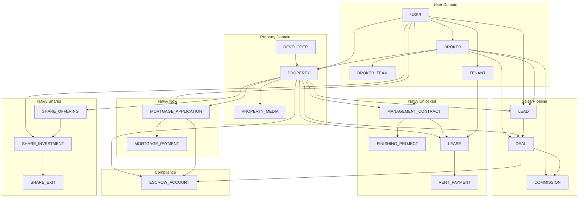
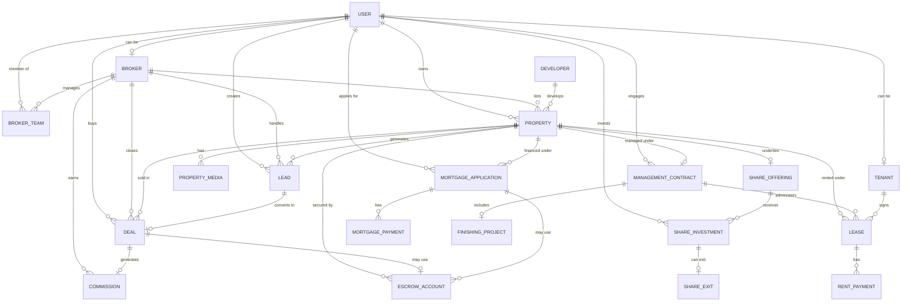

# Nawy Proptech Platform — Database Design

> **A complete, production-ready data model for Egypt's largest proptech ecosystem**

---

## 📖 Table of Contents

- [Overview](#-overview)
- [Business Context](#-business-context)
- [Architecture Principles](#-architecture-principles)
- [Entity-Relationship Diagram](#-entity-relationship-diagram)
- [Table Descriptions](#-table-descriptions)
- [Relationship Mapping](#-relationship-mapping)
- [Analytical Views](#-analytical-views)

---

## 🎯 Overview

This repository contains the **complete database design and implementation** for a Nawy-style proptech platform — a vertically integrated real estate ecosystem serving buyers, sellers, investors, and brokers across Egypt and Africa.

The design models Nawy's **five distinct business lines**:

| Business Line | Function | Revenue Model |
|---------------|----------|---------------|
| **Nawy Properties** | Multi-listing service (MLS) for buying/selling | Listing fees + transaction commissions |
| **Nawy Partners** | B2B platform for MSME brokers | Commission share on closed deals |
| **Nawy Now** | FRA-licensed mortgage origination | Interest on mortgage loans |
| **Nawy Shares** | Fractional ownership platform | Exit fees + management fees |
| **Nawy Unlocked** | Property finishing, furnishing & rental management | Management fees + finishing financing |

### 📦 Deliverables

| Deliverable | Status |
|-------------|--------|
| **20 tables** covering all business operations | ✅ |
| **34 relationships** with full referential integrity | ✅ |
| **23 analytical views** for BI tools | ✅ |
| **~13,000 sample records** across 5 years (2021–2026) | ✅ |
| **Complete SQL Server DDL** and data generation scripts | ✅ |
| **Regulatory compliance** with Egyptian FRA requirements | ✅ |

---

## 🏢 Business Context

### What is Nawy?

Nawy is Egypt's leading proptech company, serving over **1 million monthly active users** and **3,000+ MSME real estate brokerages**. The platform connects property buyers, sellers, developers, investors, and brokers through a unified digital experience.

### Why This Data Model Exists

A traditional real estate platform would only need a `PROPERTY` and `USER` table. Nawy is different — it operates **five complementary business lines** that must share data while remaining functionally independent:

**1. Same property, multiple purposes**
A single property can simultaneously be:
- A listing on **Nawy Properties**
- The target of a **Nawy Now** mortgage application
- The underlying asset of a **Nawy Shares** offering
- A managed unit under **Nawy Unlocked**

**2. Same user, multiple roles**
A user can be a buyer, seller, investor, broker, or landlord at the same time. Nawy's growth strategy depends on cross-selling across these roles.

**3. Regulated financial services**
Nawy Now and Nawy Shares are licensed by Egypt's **Financial Regulatory Authority (FRA)**, requiring strict KYC, escrow, and reporting.

**4. Data-driven decision making**
The platform uses machine learning and tailored algorithms to recommend properties and predict buyer behavior. This requires a rich, well-structured data foundation.

This data model was designed to support all four requirements without compromise.

---

## 🏗️ Architecture Principles

The database design follows **seven core principles**:

| # | Principle | Implementation |
|---|-----------|----------------|
| 1 | **Single Source of Identity** | All actors trace back to `USER.user_id` |
| 2 | **Single Source of Asset** | All property transactions trace back to `PROPERTY.property_id` |
| 3 | **Separation of Business Lines** | Each service (Now, Shares, Unlocked) has dedicated tables |
| 4 | **Explicit Financial Flows** | Every money movement has its own table with status tracking |
| 5 | **Regulatory Traceability** | Full audit trails for FRA and Real Estate Public Authority compliance |
| 6 | **Analytical Enablement** | Denormalized views for BI tools (Tableau, Power BI) |
| 7 | **Referential Integrity** | Strict FK constraints with CASCADE/SET NULL semantics |

---

## 📊 Entity-Relationship Diagram

### High-Level Domain View

### Detailed ERD

### Relationship Summary

| Domain | Tables | Key Relationships |
|--------|--------|-------------------|
| **User** | 4 | USER extends to BROKER, TENANT; BROKER manages BROKER_TEAM |
| **Property** | 3 | DEVELOPER supplies PROPERTY; PROPERTY has PROPERTY_MEDIA |
| **Sales** | 3 | LEAD converts to DEAL; DEAL generates COMMISSION |
| **Nawy Now** | 2 | MORTGAGE_APPLICATION has many MORTGAGE_PAYMENT |
| **Nawy Shares** | 3 | SHARE_OFFERING receives SHARE_INVESTMENT; investment has SHARE_EXIT |
| **Nawy Unlocked** | 4 | MANAGEMENT_CONTRACT includes FINISHING_PROJECT and LEASE; LEASE has RENT_PAYMENT |
| **Compliance** | 1 | ESCROW_ACCOUNT linked to DEAL or MORTGAGE_APPLICATION |

---

## 📋 Table Descriptions

### Group 1 — User & Access Management

#### `USER`
Central identity table for all platform participants.

| Column | Type | Description |
|--------|------|-------------|
| `user_id` | BIGINT (PK) | Unique identifier |
| `email` | NVARCHAR(255) | Login identifier (unique) |
| `phone` | NVARCHAR(20) | Mobile number (unique) |
| `full_name` | NVARCHAR(255) | Display name |
| `user_type` | NVARCHAR(50) | buyer, seller, investor, broker, admin |
| `national_id` | NVARCHAR(14) | Egyptian national ID (unique) |
| `password_hash` | NVARCHAR(MAX) | Bcrypt hash |
| `is_verified` | BIT | Email/phone verified |
| `created_at` | DATETIMEOFFSET | Registration timestamp |
| `updated_at` | DATETIMEOFFSET | Last profile change |

#### `BROKER`
Extended profile for MSME real estate brokers on Nawy Partners.

| Column | Type | Description |
|--------|------|-------------|
| `broker_id` | BIGINT (PK) | Unique identifier |
| `user_id` | BIGINT (FK) | References `USER` (unique) |
| `broker_type` | NVARCHAR(50) | freelancer, agency |
| `agency_name` | NVARCHAR(255) | Agency name (NULL for freelancers) |
| `license_number` | NVARCHAR(100) | Real Estate Public Authority license |
| `commission_rate` | DECIMAL(5,4) | Default commission (2.5%) |
| `team_size` | INT | Number of sub-agents |
| `status` | NVARCHAR(20) | active, suspended, inactive |
| `joined_at` | DATETIMEOFFSET | Platform join date |

#### `BROKER_TEAM`
Junction table for agency brokers managing sub-agents.

| Column | Type | Description |
|--------|------|-------------|
| `team_id` | BIGINT (PK) | Unique identifier |
| `broker_id` | BIGINT (FK) | Agency broker |
| `member_user_id` | BIGINT (FK) | Team member |
| `role` | NVARCHAR(50) | senior_agent, junior_agent |
| `added_at` | DATETIMEOFFSET | Join date |

#### `TENANT`
Extended profile for verified renters under Nawy Unlocked.

| Column | Type | Description |
|--------|------|-------------|
| `tenant_id` | BIGINT (PK) | Unique identifier |
| `user_id` | BIGINT (FK) | References `USER` (unique) |
| `verification_status` | NVARCHAR(20) | pending, verified |
| `employment_status` | NVARCHAR(50) | employed, self_employed, etc. |
| `monthly_income` | DECIMAL(12,2) | For affordability checks |

---

### Group 2 — Property & Listings

#### `DEVELOPER`
Real estate developer companies.

| Column | Type | Description |
|--------|------|-------------|
| `developer_id` | BIGINT (PK) | Unique identifier |
| `name` | NVARCHAR(255) | Company name |
| `description` | NVARCHAR(MAX) | Company overview |
| `contact_email` | NVARCHAR(255) | B2B contact |
| `contact_phone` | NVARCHAR(20) | B2B phone |
| `total_projects` | INT | Active project count |
| `partnership_tier` | NVARCHAR(20) | standard, premium, exclusive |
| `created_at` | DATETIMEOFFSET | Record creation |

#### `PROPERTY`
Core asset table — central to all business lines.

| Column | Type | Description |
|--------|------|-------------|
| `property_id` | BIGINT (PK) | Unique identifier |
| `title` | NVARCHAR(500) | Listing title |
| `description` | NVARCHAR(MAX) | Full description |
| `property_type` | NVARCHAR(50) | apartment, villa, townhouse, office, chalet, duplex |
| `listing_type` | NVARCHAR(20) | primary, resale, rental |
| `city` | NVARCHAR(100) | City name |
| `district` | NVARCHAR(100) | Neighborhood |
| `compound_name` | NVARCHAR(255) | Compound/project name |
| `latitude`, `longitude` | DECIMAL | GPS coordinates |
| `bedrooms`, `bathrooms` | INT | Room counts |
| `area_sqm` | DECIMAL(10,2) | Area in square meters |
| `finishing_status` | NVARCHAR(50) | shell, semi_finished, finished, luxury |
| `furnished_status` | NVARCHAR(50) | unfurnished, semi_furnished, fully_furnished |
| `price` | DECIMAL(15,2) | Listing price |
| `currency` | NVARCHAR(3) | EGP, USD |
| `delivery_date` | DATE | Expected delivery (off-plan) |
| `status` | NVARCHAR(20) | active, sold, rented, reserved, under_offer |
| `developer_id` | BIGINT (FK) | References `DEVELOPER` |
| `owner_user_id` | BIGINT (FK) | References `USER` |
| `listing_broker_id` | BIGINT (FK) | References `BROKER` |

#### `PROPERTY_MEDIA`
Images, videos, and virtual tours per property.

| Column | Type | Description |
|--------|------|-------------|
| `media_id` | BIGINT (PK) | Unique identifier |
| `property_id` | BIGINT (FK) | References `PROPERTY` |
| `media_type` | NVARCHAR(20) | image, video, virtual_tour |
| `url` | NVARCHAR(MAX) | CDN URL |
| `display_order` | INT | Sort order |
| `is_primary` | BIT | Primary image flag |
| `uploaded_at` | DATETIMEOFFSET | Upload timestamp |

---

### Group 3 — Sales Pipeline

#### `LEAD`
Buyer interest and sales funnel tracking.

| Column | Type | Description |
|--------|------|-------------|
| `lead_id` | BIGINT (PK) | Unique identifier |
| `property_id` | BIGINT (FK) | References `PROPERTY` |
| `buyer_user_id` | BIGINT (FK) | References `USER` |
| `broker_id` | BIGINT (FK) | Assigned broker |
| `status` | NVARCHAR(30) | new, contacted, viewing, negotiation, closed_won, closed_lost |
| `source` | NVARCHAR(50) | website, app, broker_referral, walk_in |
| `notes` | NVARCHAR(MAX) | Broker notes |
| `created_at` | DATETIMEOFFSET | Lead creation |
| `last_activity_at` | DATETIMEOFFSET | Last interaction |

#### `DEAL`
Completed property transactions.

| Column | Type | Description |
|--------|------|-------------|
| `deal_id` | BIGINT (PK) | Unique identifier |
| `lead_id` | BIGINT (FK) | Originating lead |
| `property_id` | BIGINT (FK) | Sold property |
| `buyer_user_id` | BIGINT (FK) | Buyer |
| `broker_id` | BIGINT (FK) | Closing broker |
| `sale_price` | DECIMAL(15,2) | Final sale price |
| `payment_type` | NVARCHAR(20) | cash, installment, mortgage |
| `status` | NVARCHAR(20) | pending, approved, completed, cancelled |
| `closed_at` | DATETIMEOFFSET | Closing timestamp |

#### `COMMISSION`
Broker commission payments from completed deals.

| Column | Type | Description |
|--------|------|-------------|
| `commission_id` | BIGINT (PK) | Unique identifier |
| `deal_id` | BIGINT (FK) | References `DEAL` |
| `broker_id` | BIGINT (FK) | Receiving broker |
| `commission_amount` | DECIMAL(12,2) | Amount |
| `commission_rate` | DECIMAL(5,4) | Applied rate |
| `status` | NVARCHAR(20) | pending, paid |
| `paid_at` | DATETIMEOFFSET | Payment timestamp |

---

### Group 4 — Nawy Now (Mortgage)

#### `MORTGAGE_APPLICATION`
FRA-licensed mortgage origination applications.

| Column | Type | Description |
|--------|------|-------------|
| `application_id` | BIGINT (PK) | Unique identifier |
| `user_id` | BIGINT (FK) | Applicant |
| `property_id` | BIGINT (FK) | Property to finance |
| `property_price` | DECIMAL(15,2) | Full price |
| `down_payment` | DECIMAL(15,2) | ≥ 10% of price |
| `loan_amount` | DECIMAL(15,2) | = price − down |
| `installment_months` | INT | 36 to 120 |
| `interest_rate` | DECIMAL(5,4) | Annual rate |
| `monthly_payment` | DECIMAL(12,2) | Fixed installment |
| `status` | NVARCHAR(30) | submitted, under_review, approved, rejected, disbursed |
| `submitted_at` | DATETIMEOFFSET | Submission |
| `approved_at` | DATETIMEOFFSET | Approval timestamp |

#### `MORTGAGE_PAYMENT`
Individual installment payments.

| Column | Type | Description |
|--------|------|-------------|
| `payment_id` | BIGINT (PK) | Unique identifier |
| `application_id` | BIGINT (FK) | Parent application |
| `installment_number` | INT | Sequential number |
| `amount_due` | DECIMAL(12,2) | Expected payment |
| `amount_paid` | DECIMAL(12,2) | Actual payment |
| `due_date` | DATE | Due date |
| `paid_date` | DATE | Payment date |
| `status` | NVARCHAR(20) | pending, paid, overdue |

---

### Group 5 — Nawy Shares (Fractional Investment)

#### `SHARE_OFFERING`
Fractional ownership offerings.

| Column | Type | Description |
|--------|------|-------------|
| `offering_id` | BIGINT (PK) | Unique identifier |
| `property_id` | BIGINT (FK) | Underlying property (unique) |
| `total_value` | DECIMAL(15,2) | Total property value |
| `share_price` | DECIMAL(12,2) | Price per share |
| `total_shares` | INT | Total shares available |
| `shares_available` | INT | Remaining shares |
| `offering_open_date` | DATE | Subscription start |
| `offering_close_date` | DATE | Subscription end |
| `exit_condition` | NVARCHAR(MAX) | Exit criteria |
| `status` | NVARCHAR(20) | upcoming, open, closed, sold_out |

#### `SHARE_INVESTMENT`
Individual investor purchases of fractional shares.

| Column | Type | Description |
|--------|------|-------------|
| `investment_id` | BIGINT (PK) | Unique identifier |
| `offering_id` | BIGINT (FK) | Parent offering |
| `user_id` | BIGINT (FK) | Investor |
| `shares_purchased` | INT | Number of shares |
| `total_amount` | DECIMAL(12,2) | Amount paid |
| `investment_date` | DATETIMEOFFSET | Purchase date |
| `status` | NVARCHAR(20) | active, exited |

#### `SHARE_EXIT`
Records the sale/exit of a fractional investment.

| Column | Type | Description |
|--------|------|-------------|
| `exit_id` | BIGINT (PK) | Unique identifier |
| `investment_id` | BIGINT (FK) | Investment being exited (unique) |
| `exit_price_per_share` | DECIMAL(12,2) | Sale price per share |
| `total_sale_value` | DECIMAL(15,2) | Total proceeds |
| `exit_fee_percent` | DECIMAL(5,4) | 2.5%–5% |
| `profit_loss` | DECIMAL(12,2) | Net gain/loss |
| `exit_date` | DATE | Exit date |
| `status` | NVARCHAR(20) | pending, completed |

---

### Group 6 — Nawy Unlocked (Property Management)

#### `MANAGEMENT_CONTRACT`
Property management agreements.

| Column | Type | Description |
|--------|------|-------------|
| `contract_id` | BIGINT (PK) | Unique identifier |
| `property_id` | BIGINT (FK) | Managed property |
| `owner_user_id` | BIGINT (FK) | Property owner |
| `service_type` | NVARCHAR(50) | finishing, furnishing, full_management, rental_only |
| `management_fee_percent` | DECIMAL(5,4) | Fee on rental income |
| `financing_percent` | DECIMAL(5,4) | Up to 50% of finishing costs |
| `contract_start` | DATE | Start date |
| `contract_end` | DATE | End date |
| `status` | NVARCHAR(20) | active, expired, terminated |

#### `FINISHING_PROJECT`
Finishing and furnishing work under a management contract.

| Column | Type | Description |
|--------|------|-------------|
| `project_id` | BIGINT (PK) | Unique identifier |
| `contract_id` | BIGINT (FK) | Parent contract |
| `scope` | NVARCHAR(50) | core_shell, semi_finished, refurbishment, furnishing |
| `budget` | DECIMAL(12,2) | Planned budget |
| `actual_cost` | DECIMAL(12,2) | Actual cost |
| `start_date` | DATE | Work start |
| `completion_date` | DATE | Work completion |
| `status` | NVARCHAR(20) | planned, in_progress, completed |

#### `LEASE`
Rental agreements between tenants and managed properties.

| Column | Type | Description |
|--------|------|-------------|
| `lease_id` | BIGINT (PK) | Unique identifier |
| `property_id` | BIGINT (FK) | Rented property |
| `contract_id` | BIGINT (FK) | Parent management contract |
| `tenant_id` | BIGINT (FK) | Tenant |
| `start_date` | DATE | Lease start |
| `end_date` | DATE | Lease end |
| `monthly_rent` | DECIMAL(12,2) | Monthly amount |
| `security_deposit` | DECIMAL(12,2) | Refundable deposit |
| `status` | NVARCHAR(20) | active, expired, terminated |

#### `RENT_PAYMENT`
Individual rent payments.

| Column | Type | Description |
|--------|------|-------------|
| `rent_payment_id` | BIGINT (PK) | Unique identifier |
| `lease_id` | BIGINT (FK) | Parent lease |
| `amount` | DECIMAL(12,2) | Payment amount |
| `due_date` | DATE | Due date |
| `paid_date` | DATE | Payment date |
| `status` | NVARCHAR(20) | pending, paid, overdue |

---

### Group 7 — Compliance

#### `ESCROW_ACCOUNT`
Regulatory escrow accounts for off-plan and mortgage transactions.

| Column | Type | Description |
|--------|------|-------------|
| `escrow_id` | BIGINT (PK) | Unique identifier |
| `deal_id` | BIGINT (FK) | Associated deal (nullable) |
| `mortgage_id` | BIGINT (FK) | Associated mortgage (nullable) |
| `property_id` | BIGINT (FK) | Secured property |
| `bank_name` | NVARCHAR(255) | Escrow bank |
| `account_number` | NVARCHAR(50) | Bank account reference |
| `deposit_amount` | DECIMAL(15,2) | Amount held |
| `release_condition` | NVARCHAR(MAX) | Release conditions |
| `release_date` | DATE | Actual release |
| `status` | NVARCHAR(20) | active, released, disputed |

---

## 📈 Analytical Views

23 views organized into 8 domains:

### User Analytics

| View | Purpose |
|------|---------|
| `vw_UserProfile` | Enriched user dimension with broker/tenant attributes |
| `vw_UserCrossSell` | Cross-business engagement flags |
| `vw_UserLifetimeValue` | Total revenue per user across all business lines |

### Property Analytics

| View | Purpose |
|------|---------|
| `vw_PropertyFull` | Denormalized property master with developer/broker/owner |
| `vw_PropertyPricing` | Aggregated pricing statistics by location/type |
| `vw_PropertyRevenue` | Total revenue per property across all services |

### Sales Pipeline

| View | Purpose |
|------|---------|
| `vw_SalesFunnel` | Lead-to-deal conversion tracking |
| `vw_BrokerPerformance` | Broker KPIs: leads, deals, commissions |
| `vw_DealSummary` | Closed deals with full context and price delta |

### Nawy Now

| View | Purpose |
|------|---------|
| `vw_MortgagePortfolio` | Complete mortgage portfolio view |
| `vw_MortgagePaymentStatus` | Installment tracking with late payment flags |
| `vw_MortgageRisk` | Borrower risk scoring with category |

### Nawy Shares

| View | Purpose |
|------|---------|
| `vw_SharesOfferingPerformance` | Offering KPIs: sold %, investors, raised |
| `vw_SharesInvestorROI` | ROI per investor per investment |
| `vw_SharesPipeline` | Current state of all offerings |

### Nawy Unlocked

| View | Purpose |
|------|---------|
| `vw_OccupancyRates` | Occupancy status per managed property |
| `vw_RentalIncome` | Rental revenue per property with fee breakdown |
| `vw_ManagementPerformance` | Service line P&L by city and service type |

### Compliance

| View | Purpose |
|------|---------|
| `vw_EscrowCompliance` | Escrow usage and release tracking |
| `vw_EscrowHoldTime` | Average holding period analysis |

### Executive

| View | Purpose |
|------|---------|
| `vw_MarketOverview` | Market KPIs by city and property type |
| `vw_ExecutiveDashboard` | Single-screen top-level KPIs |
| `vw_RevenueByBusinessLine` | Revenue split across all 5 business lines |

